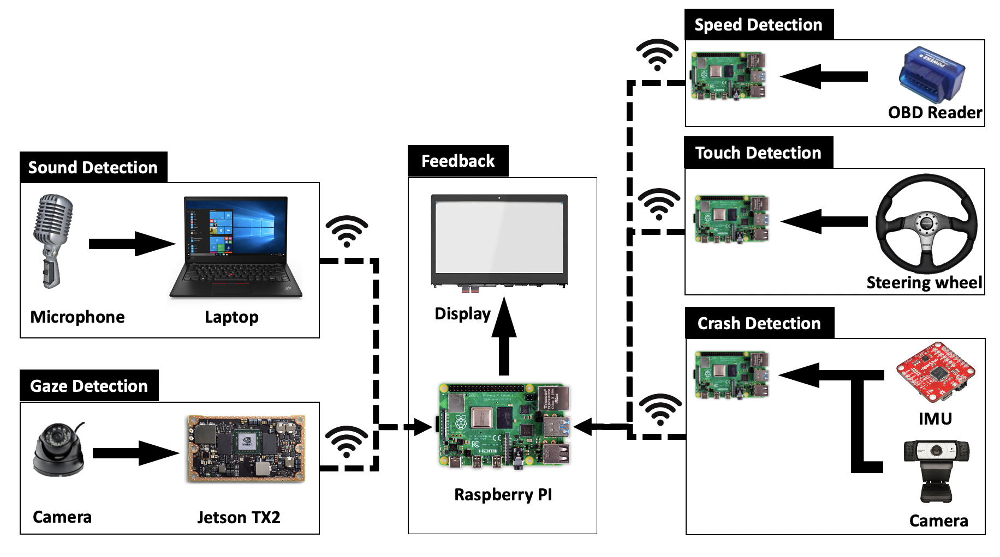
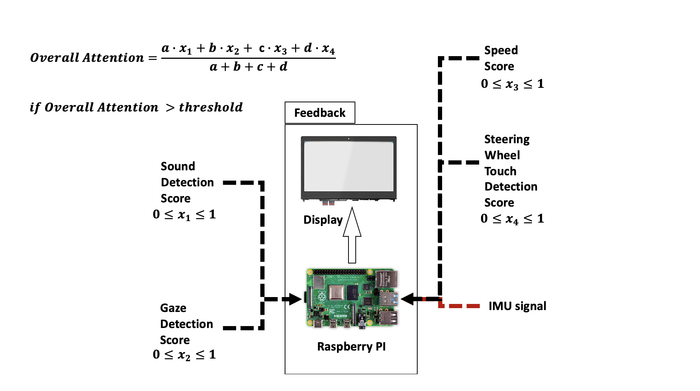
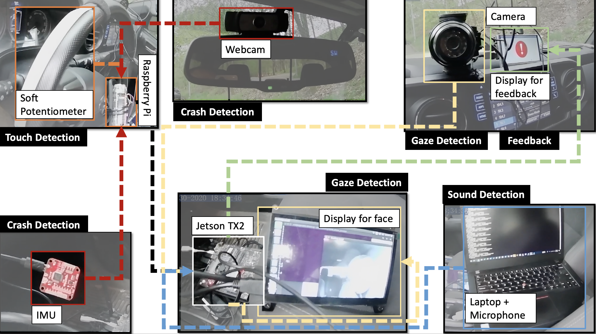

# Driver Monitoring System
Summary of Driver Monitoring System structure

## System Components & Structure

### Gaze Detection
1. Hardware: Camera/Infrared camera and Nvidia Jetson TX2

2. Software: Open Face 2.0 and Face_recognition library

### Crash Detection
1. Hardware: SEN-14001 IMU, Raspberry Pi 3

### Touch Detection
1. Hardware: Soft Potentiometer, ADC

### System Structure

### Score Mathmatics

## Integrated System
The integrated system is shown as below:

